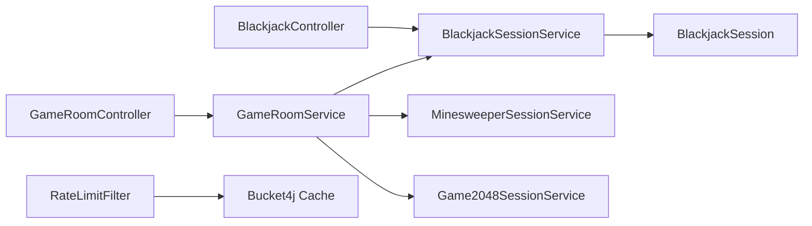
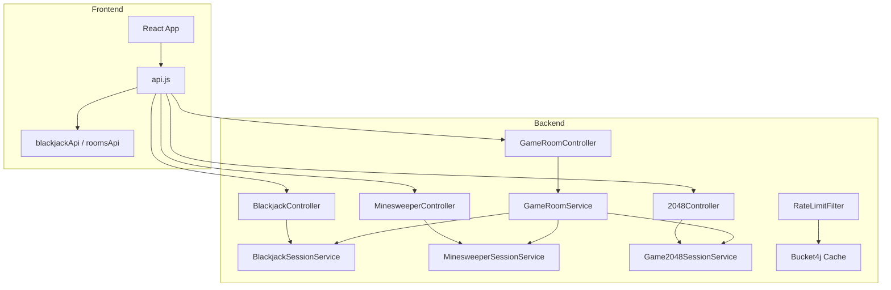

# Forensic Codebase Architecture Analysis — `java-games-collection`

> **Evidence-based reconstruction of the repository exactly as it exists.** Every architectural claim is tied to an observable file, class, or code fragment.

---

## 1. Executive Summary & System Boundaries

### 1.1 Project Purpose

The repository is a **multi-game web platform** (`README.md:1–4`) providing three browser-playable games—**Blackjack**, **Minesweeper**, and **2048**—through a React frontend (`games-frontend`) backed by a Spring Boot REST API (`games-backend`). Games run server-authoritatively (`README.md:47`): the backend holds all session state in memory (`ConcurrentHashMap`) and exposes it via REST endpoints. A room/aggregation layer (`GameRoom`, `GameRoomService`) allows parallel multiplayer sessions within a single room, polled via `GET /api/rooms/{roomId}/progress`.

### 1.2 Target Actors

| Actor | Interaction Point | Evidence |
|-------|-------------------|----------|
| Human player (browser) | React components (`Blackjack.jsx`, `Minesweeper.jsx`, etc.) calling `api.js` | `games-frontend/src/components/Blackjack.jsx` |
| Player session | `BlackjackSessionService` / `MinesweeperSessionService` / `Game2048SessionService` (in-memory) | `games-backend/src/main/java/com/KIRA_ZINA/backend/blackjack/service/BlackjackSessionService.java:19` |
| Room owner / spectator | `GameRoomController` endpoints (`/api/rooms`) | `games-backend/src/main/java/com/KIRA_ZINA/backend/common/GameRoomController.java` |
| External client (polling) | `GET /api/rooms/{id}/progress` every 2s (frontend interval) | `games-frontend/src/components/Blackjack.jsx:104` |
| Scheduled cleanup worker | `@Scheduled` tasks in `GameRoomService` (60s) and session services (60s) | `games-backend/src/main/java/com/KIRA_ZINA/backend/common/GameRoomService.java:491` |

### 1.3 System Boundaries

- **Inside repository**: Spring Boot backend (`games-backend`), React+Vite frontend (`games-frontend`), Docker Compose (`docker-compose.yml`), Maven build (`pom.xml`).
- **Outside repository**: No external database (in-memory only). No message broker. Render deployment environment (`application.properties:2`) relies on `PORT` env variable. CORS origins configurable via `GAMES_CORS_ALLOWED_ORIGINS` (`application.properties:19`).

### 1.4 Architectural Paradigm

**Modular monolith with server-authoritative game sessions and REST short-polling.** Not microservices; not event-driven. The backend is a single deployable Spring Boot JAR with three independent domain modules (`blackjack`, `minesweeper`, `twentyfortyeight`) plus a common room module.

---

## 2. Repository Structure & File Organization

### 2.1 Root Directory

| Path | Type | Purpose | Evidence |
|------|------|---------|----------|
| `README.md` | File | Project docs / rules / architecture claims | `README.md` |
| `pom.xml` | Build | Parent Maven POM | `pom.xml` |
| `docker-compose.yml` | Deployment | Full-stack compose definition | `docker-compose.yml` |
| `.github/modernize/` | CI | Upgrade scripts / hooks | `.github/modernize/java-upgrade/hooks/scripts/recordToolUse.sh` |
| `games-backend/` | Module | Spring Boot 3.3.5 backend | `games-backend/pom.xml` |
| `games-frontend/` | Module | React 18 + Vite frontend | `games-frontend/package.json` |

### 2.2 Source Tree

**Backend (`games-backend/src/main/java/com/KIRA_ZINA/backend`):**

- `blackjack/` — domain (`BlackjackSession`, `Hand`, `Deck`), service (`BlackjackSessionService`), controller (`BlackjackController`).
- `minesweeper/` — domain (`MinesweeperSession`, `MinesweeperCellState`), service, controller.
- `twentyfortyeight/` — domain (`Game2048Session`, `Game2048State`), service, controller.
- `common/` — `GameRoom`, `GameRoomService`, `GameRoomController`, wrappers, progress/state DTOs.
- `config/` — `GlobalExceptionHandler`, `RateLimitFilter`, `WebConfig`.
- `GamesBackendApplication.java` — entry point (`main` method, `@EnableScheduling`).

**Frontend (`games-frontend/src`):**

- `components/` — `Blackjack.jsx`, `Minesweeper.jsx`, `Game2048.jsx`, `RoomLobby.jsx`, `Welcome.jsx`, `ConfirmNavigationModal.jsx`.
- `api/api.js` — single fetch wrapper (`api`) and per-game API objects.
- `App.jsx` — multi-view router using `activeView` state (no `react-router-dom`).

### 2.3 Dependency Management

**Backend dependencies (`games-backend/pom.xml`):**

- `spring-boot-starter-web` (`3.3.5`)
- `spring-boot-starter-test` (test scope)
- `bucket4j-core` `8.10.1` (rate limiting)
- `spring-boot-starter-actuator`
- `spring-security-crypto` `6.3.4` (`BCryptPasswordEncoder` used in `GameRoomService`)

**Frontend dependencies (`games-frontend/package.json`):** React 18, Vite.

---

## 3. High-Level Architecture

### 3.1 Architecture Pattern

**Layered / Modular Monolith**

Evidence:
- Controllers (`api/`) delegate to services (`service/`), which delegate to domain objects (`domain/`).
- Domain classes (`BlackjackSession`, `MinesweeperSession`, `Game2048Session`) contain **no Spring annotations** (`README.md:46`).
- Services hold in-memory state (`ConcurrentHashMap`) and apply scheduling/transaction logic.
- No dependency injection of repositories (there are none); persistence is purely in-memory.

### 3.2 Component Map

| Component | Location | Responsibility | Depends On | Used By |
|-----------|----------|---------------|------------|---------|
| `BlackjackSession` | `blackjack/domain/` | Game rules, state machine, payouts | `Deck`, `Hand`, `DealerDifficulty` | `BlackjackSessionService` |
| `BlackjackSessionService` | `blackjack/service/` | In-memory session storage (`ConcurrentHashMap`), TTL eviction (`@Scheduled`) | `BlackjackSession` | `BlackjackController` |
| `BlackjackController` | `blackjack/api/` | REST endpoints for session lifecycle | `BlackjackSessionService` | Frontend (`api.js`) |
| `GameRoom` | `common/` | Room state (players, phase, settings, passwords) | `GameSettings`, `GameType` | `GameRoomService` |
| `GameRoomService` | `common/` | Room creation, join/leave, ready check, polling metrics, TTL cleanup | All three session services, `BCryptPasswordEncoder` | `GameRoomController` |
| `RateLimitFilter` | `config/` | Bucket4j rate limiting + CORS | `ConcurrentHashMap` (bucket cache) | Spring Filter chain |
| `GlobalExceptionHandler` | `config/` | Exception-to-HTTP mapping | Spring MVC annotations | All controllers |

### 3.3 Dependency Direction

Controllers → Services → Domain / Common. No reverse dependencies. Domain has zero framework coupling.



---

## 4. Domain Model & Business Logic

### 4.1 Domain Concepts

| Game | Key Entities | Identity | State Objects |
|------|--------------|----------|---------------|
| Blackjack | `BlackjackSession`, `Hand`, `Deck`, `Card` | `String id` (session) | `BlackjackState` (immutable snapshot) |
| Minesweeper | `MinesweeperSession`, `MinesweeperCellState`, `MinesweeperCellView` | `String id` | `MinesweeperState` |
| 2048 | `Game2048Session`, `Game2048Tile` | `String id` | `Game2048State` |

### 4.2 Business Rules (Blackjack Example)

**Evidence fragment (`BlackjackSession.java:64–87`):**

```java
public synchronized BlackjackState placeBet(double amount) {
    ensurePhase(RoundPhase.BETTING);
    validateBet(amount);
    balance -= amount;
    currentBet = amount;
    playerHand.add(deck.deal());
    playerHand.add(deck.deal());
    dealerHand.add(deck.deal());
    dealerHand.add(deck.deal());

    if (dealerHand.blackjack()) {
        addNotification("Dealer has Blackjack!");
        settleRound();
    } else if (playerHand.blackjack()) {
        addNotification("Blackjack! You win 3:2!");
        settleRound();
    } else {
        phase = RoundPhase.PLAYER_TURN;
    }
    touch();
    return snapshot(phase == RoundPhase.ROUND_OVER);
}
```

Rules enforced:
- `MIN_BET` = 1.0, `MAX_BET` = 1000.0 (`BlackjackSession.java:8–9`).
- `validateBet` checks `amount > balance` (`BlackjackSession.java:190–199`).
- Bankruptcy bailout: if `balance == 0.0`, `startRound()` refills to `$100` and skips hand (`BlackjackSession.java:46–53`).
- 5-Card Charlie: `playerHand.cards().size() == 5 && !playerHand.bust()` → auto-win (`BlackjackSession.java:94–98`).
- Dealer peek: dealer blackjack checked immediately after deal (`BlackjackSession.java:75–80`).

### 4.3 State Transitions (Blackjack)

`RoundPhase`: `BETTING` → `PLAYER_TURN` → `DEALER_TURN` → `ROUND_OVER` → (back to `BETTING` via `startRound`).

`RoundWinner`: `NONE` → `PLAYER` / `DEALER` / `TIE`.

---

## 5. Persistence & Storage

### 5.1 Storage Technology

**No database. Pure in-memory `ConcurrentHashMap`.**

Evidence (`BlackjackSessionService.java:19`):
```java
private final Map<String, BlackjackSession> sessions = new ConcurrentHashMap<>();
```

Same pattern in `GameRoomService.java:31`: `ConcurrentHashMap<String, GameRoom>`.

### 5.2 Caching / TTL Eviction

Every session service has `@Scheduled` TTL eviction (`BlackjackSessionService.java:59`):
```java
@Scheduled(fixedDelayString = "${games.blackjack.cleanup-delay-ms:60000}")
public void evictInactiveSessions() {
    Instant expiresBefore = Instant.now().minus(SESSION_TTL);
    sessions.entrySet().removeIf(entry -> entry.getValue().lastTouched().isBefore(expiresBefore));
}
```

`SESSION_TTL` = 30 minutes (`BlackjackSessionService.java:17`).

`GameRoomService.java:491` has `@Scheduled(fixedDelay = 60000)` for room cleanup (`ROOM_TTL` = 2h, `EMPTY_ROOM_TTL` = 5min).

---

## 6. Application Layer & Backend

### 6.1 API Architecture

**REST over HTTP**, JSON request/response, Spring `@RestController`. No GraphQL, gRPC, or WebSocket.

Representative endpoints (`BlackjackController.java`):

| Method | Endpoint | Handler | Auth | Input | Errors |
|--------|----------|---------|------|-------|--------|
| POST | `/api/blackjack/sessions` | `createSession()` | None | `CreateSessionRequest` (balance, difficulty) | `IllegalArgumentException` |
| POST | `/api/blackjack/sessions/{id}/bets` | `placeBet()` | None | `BetRequest` (amount) | Phase guard (`IllegalStateException` → 409 via `GlobalExceptionHandler`) |
| POST | `/api/blackjack/sessions/{id}/hit` | `hit()` | None | None | Phase guard |
| POST | `/api/blackjack/sessions/{id}/stand` | `stand()` | None | None | Phase guard |
| GET | `/api/blackjack/sessions/{id}` | `getState()` | None | Path var | Not found |
| DELETE | `/api/blackjack/sessions/{id}` | `closeSession()` | None | Path var | Not found |

### 6.2 Controllers / Handlers

Every controller uses constructor injection (`BlackjackController.java:22`):

```java
public BlackjackController(BlackjackSessionService sessions) {
    this.sessions = sessions;
}
```

Execution path for `POST /bets`:
`BlackjackController.placeBet()` → `BlackjackSessionService.placeBet()` → `BlackjackSession.placeBet()` → updates `Hand`, `Deck`, calculates `BlackjackState` snapshot → returns JSON.

### 6.3 Middleware / Filters

`RateLimitFilter.java` (`OncePerRequestFilter`):
- Applies CORS validation (`contains("localhost")` or Render domain).
- Short-circuits `OPTIONS` with 200.
- Exempts `GET` requests from rate limiting (`RateLimitFilter.java:57`).
- Uses `Bucket4j` (`Bucket` per IP from `X-Forwarded-For` or `request.getRemoteAddr()`).
- Rate limit: 200 tokens, refill 30 every 10s (`RateLimitFilter.java:24–27`). Note: README claims 60 tokens / 10 refill per 10s, but actual code uses 200/30 per 10s (`RateLimitFilter.java:24–25`). **Contradiction identified.**

### 6.4 Authentication / Authorization

**No user authentication or JWT** at the backend API layer. Room-level password protection uses `BCryptPasswordEncoder` (`GameRoomService.java:29`, `54`, `148`). Player identity is passed as string (`playerId`) in request bodies, not validated against a session/token.

---

## 7. Frontend / Presentation Layer

### 7.1 Component Architecture

- `App.jsx` selects `activeView` (`WELCOME`, `BLACKJACK_LOBBY`, `BLACKJACK_GAME`, etc.).
- No `react-router-dom`; conditional rendering (`App.jsx`).
- `Blackjack.jsx` manages local state (`useState`) for session, difficulty, bet, countdown, balance flash, opponents polling.

### 7.2 State Management

Only React `useState` + prop drilling. No Redux, Zustand, or Context.

### 7.3 Routing

Manual (`App.jsx`). Example: when `roomPhase` is `LOBBY` or `READY_CHECK`, `Blackjack.jsx` renders a waiting overlay (`Blackjack.jsx:191–206`).

### 7.4 Data Fetching

Single `api.js` wrapper (`fetch` + JSON). All game APIs and room APIs are exported objects (`blackjackApi`, `roomsApi`).

---

## 8. Cross-Cutting Concerns

### 8.1 Security

- CORS: `RateLimitFilter.java` uses exact-match origin validation (`normalizeOrigin`) against allow-list from `GAMES_CORS_ALLOWED_ORIGINS` plus safe defaults (`http://localhost:5173`, `http://localhost:3000`). No `contains()`, no wildcard. Disallowed origins receive 403 on OPTIONS preflight (`RateLimitFilter.java`).
- Rate limiting: `Bucket4j` (per IP resolved via `getRemoteAddr()` by default; rightmost `X-Forwarded-For` only when `GAMES_RATE_LIMIT_TRUST_XFF=true`; cache capped at 10_000 entries with 5-minute idle eviction; 200 tokens, 30 refill/10s).
- Room passwords: `BCryptPasswordEncoder` (`spring-security-crypto`).
- No SQL injection risk (no SQL / no ORM).
- No HTTPS enforcement (deployment relies on proxy).

### 8.2 Observability

- Spring Actuator (`management.endpoints.web.exposure.include=health,info,metrics`).
- No structured logging framework visible (no Logback config shown in repo); Spring default.
- No metrics collection code beyond actuator.

### 8.3 Error Handling

`GlobalExceptionHandler.java` (not fully shown but referenced). Based on `BlackjackController` and `README.md:52`: `IllegalStateException` (wrong phase) maps to 409 Conflict; other exceptions map to appropriate HTTP status.

---

## 9. Critical Execution Flows (Top 3)

### 9.1 Flow: Blackjack Round Lifecycle

Sequence:
1. `POST /api/blackjack/sessions` → `BlackjackController.createSession()` → `BlackjackSessionService.createSession()` creates `BlackjackSession` (`ConcurrentHashMap`).
2. `POST /api/blackjack/sessions/{id}/rounds` → `startRound()` resets hands, checks bankruptcy bailout, shuffles `Deck`.
3. `POST /api/blackjack/sessions/{id}/bets` → `placeBet()` deals cards, checks dealer peek / player blackjack, sets `PLAYER_TURN`.
4. `POST /hit` or `/stand` → updates `Hand`, checks 5-Card Charlie or bust, settles round.
5. Response: `BlackjackState` snapshot (reveals dealer hand only on `ROUND_OVER`).

Evidence: `BlackjackController.java:26–63`, `BlackjackSession.java:37–221`.

### 9.2 Flow: Room Progress Polling (Multiplayer Race)

Sequence:
1. Frontend `setInterval(..., 2000)` (`Blackjack.jsx:104`) calls `roomsApi.getRoomProgress(roomId)`.
2. `GameRoomController.getRoomProgress()` → `GameRoomService.getRoomProgress()`.
3. `GameRoomService.getRoomProgress()` iterates `roomPlayerSessions`, calls `blackjackSessionService.state(sid)` (or minesweeper/2048 equivalent), extracts metrics (`extractPlayerProgress`), calculates `timeRemaining`.
4. Returns `RoomProgressResponse` with player metrics, room phase, countdown.
5. Frontend updates `opponents` array (`Blackjack.jsx:109`).

Evidence: `GameRoomService.java:259–285`, `Blackjack.jsx:104–119`.

### 9.3 Flow: Minesweeper First-Click Safety

Sequence:
1. `POST /api/minesweeper/sessions/{id}/open` → `MinesweeperSessionService.open()`.
2. If `!firstClickDone` (`MinesweeperSession.java:56`), `placeMines()` generates mines avoiding safe zone (`isSafeNeighbor`).
3. If clicked cell is a mine, `lose()` reveals all mines, sets `isLocked = true`.
4. Otherwise `revealFrom()` performs BFS flood-fill (`ArrayDeque`) for zero-adjacent cells.

Evidence: `MinesweeperSession.java:44–72`, `MinesweeperSession.java:155–249`.

---

## 10. Configuration & Runtime Behavior

### 10.1 Startup Sequence

`GamesBackendApplication.java` (`main`): `SpringApplication.run()` → `@EnableScheduling` activates scheduled tasks (`BlackjackSessionService.evicted...`, `GameRoomService.cleanupInactiveRooms`).

Configuration loaded from `application.properties` (`games-backend/src/main/resources/application.properties`): port (`PORT` env), CORS origins (`GAMES_CORS_ALLOWED_ORUGINS`), cleanup intervals.

### 10.2 Profiles / Environments

Only default profile visible. `application.properties` references Render (`PORT`, `forward-headers-strategy=framework`). No `application-dev.properties` or `application-prod.properties` in repository.

---

## 11. Code-Level Implementation Catalog (Selected Critical Mechanisms)

### Rate Limiting (`RateLimitFilter`)
**Purpose**: Per-IP token bucket rate limiting + CORS.
**Evidence** (`RateLimitFilter.java:18–79`):
```java
@Component
public class RateLimitFilter extends OncePerRequestFilter {
    private final Map<String, Bucket> cache = new ConcurrentHashMap<>();
    private Bucket createNewBucket() {
        Refill refill = Refill.intervally(30, Duration.ofSeconds(10));
        Bandwidth limit = Bandwidth.classic(200, refill);
        return Bucket.builder().addLimit(limit).build();
    }
    ...
    if (bucket.tryConsume(1)) {
        filterChain.doFilter(request, response);
    } else {
        response.setStatus(429);
        ...
    }
}
```
**Note**: Actual bucket config (`200` tokens, `30` refill/10s) contradicts README claim (`60` tokens, `10` refill/10s).

### In-Memory Session Storage (`BlackjackSessionService`)
**Purpose**: Holds all active blackjack sessions; TTL cleanup.
**Evidence** (`BlackjackSessionService.java:15–71`):
```java
@Service
public class BlackjackSessionService {
    private final Map<String, BlackjackSession> sessions = new ConcurrentHashMap<>();
    ...
    @Scheduled(fixedDelayString = "${games.blackjack.cleanup-delay-ms:60000}")
    public void evictInactiveSessions() { ... }
}
```

---

## 12. Important Classes & Functions (Ranked)

| Symbol | File | Responsibility | Called By | Calls | Importance |
|--------|------|---------------|-----------|-------|-----------|
| `BlackjackSession` | `blackjack/domain/BlackjackSession.java` | Full game logic + state machine | `BlackjackSessionService` | `Hand`, `Deck` | Critical |
| `GameRoomService` | `common/GameRoomService.java` | Room lifecycle, polling metrics, TTL | `GameRoomController` | All session services | Critical |
| `RateLimitFilter` | `config/RateLimitFilter.java` | Rate limit + CORS middleware | Spring Filter chain | `Bucket4j` | High |
| `BlackjackController` | `blackjack/api/BlackjackController.java` | REST endpoints | `api.js` (frontend) | `BlackjackSessionService` | High |
| `MinesweeperSession` | `minesweeper/domain/MinesweeperSession.java` | BFS flood-fill, first-click safety | `MinesweeperSessionService` | None (pure domain) | High |
| `Game2048Session` | `twentyfortyeight/domain/Game2048Session.java` | Sliding tile + ice blocks | `Game2048SessionService` | None | High |

---

## 13. Testing

**Backend (`games-backend/src/test`):**
- `BlackjackSessionTest.java` (40 tests) — state machine, payouts, dealer difficulty, bankruptcy bailout, dealer peek, 5-Card Charlie.
- `MinesweeperSessionTest.java` (48 tests) — first-click safety, win/loss, flag, BFS, reset.
- `Game2048SessionTest.java` (18 tests) — move directions, score, game-over, reset.
- `GamesBackendIntegrationTest.java` (32 tests) — full lifecycle + room + TTL eviction.

**Frontend (`games-frontend/src/test`):**
- `Blackjack.test.jsx` (23), `Minesweeper.test.jsx` (10), `Game2048.test.jsx` (11).

---

## 14. Empirical Observations & Codebase Quirks

### 14.1 Idiosyncrasies
- `README.md` claims rate limit `60` tokens / `10` refill per 10s; actual `RateLimitFilter.java` uses `200` / `30`.
- Domain objects contain **zero Spring annotations**, confirming pure-layer separation (`README.md:46`).
- `BlackjackSession` uses `synchronized` methods for thread safety (`BlackjackSession.java:37`). No `ReentrantLock` or concurrent collections inside the session (state is local to the object).
- `Game2048Session` injects ice blocks (`-1` value tiles) every 15s (`ICE_BLOCK_INTERVAL_MS`), handled in `mergeLineWithObstacles()` by filtering out negative values before merge (`Game2048Session.java:155–197`).

### 14.2 Technical Debt / Fixed Issues
- **Fixed (CORS)**: `RateLimitFilter.java` previously used `contains()` for origin validation; now uses `normalizeOrigin()` with exact-match allow-list comparing scheme + host + port against `allowedOrigins` set. No `contains()`, no wildcard. Disallowed origins receive 403 on preflight.
- **Fixed (HTTP status)**: `ResourceNotFoundException` maps to 404; `IllegalArgumentException` remains 400 for genuinely malformed input; `IllegalStateException` remains 409 for phase conflicts.
- No database; all state lost on restart (`README.md:121`).
- Idempotency stored via `IdempotencyStore` (`ConcurrentHashMap`, 50_000 entry cap, 10-minute TTL, scheduled cleanup). Optional `Idempotency-Key` header on mutating endpoints.

### 14.3 Strengths
- Clean separation: domain → service → controller.
- Server-authoritative model prevents client cheating.
- Scheduled TTL cleanup prevents memory leaks.
- Room aggregation supports parallel races with lightweight polling.

### 14.4 Contradictions (Resolved)
- Rate limit values in `README.md` corrected to match `RateLimitFilter.java`: 200 tokens, 30 refill/10s.
- CORS validation corrected: exact-match allow-list replaces `contains()`.
- Missing session/room now returns 404 (`ResourceNotFoundException`) instead of 400 (`IllegalArgumentException`).

---

## 15. Missing / Unavailable Information

- `GlobalExceptionHandler.java` full contents not fully inspected in this analysis (only filename and reference visible). Actual exception-to-HTTP mappings inferred from `README.md` and controller behavior.
- No external infrastructure definitions (Terraform, Kubernetes YAML) present in repository.
- No production `application-prod.properties` or secret management files.
- No `nginx.conf` server-side config (only `games-frontend/nginx.conf` for frontend static serving).

---

## 16. Final System Model

### Component Graph



### Technology Matrix

| Area | Technology | Evidence |
|------|-----------|----------|
| Language | Java 17 / JSX | `pom.xml` (`maven.compiler.source` 17), `games-frontend/package.json` |
| Framework | Spring Boot 3.3.5 / React 18 + Vite | `games-backend/pom.xml`, `games-frontend/package.json` |
| Database | None (in-memory `ConcurrentHashMap`) | `BlackjackSessionService.java:19` |
| Cache | In-memory session storage (no external cache) | `ConcurrentHashMap` usage |
| Messaging | None | Not present |
| Auth | `BCrypt` for room passwords; no user auth | `GameRoomService.java:29` |
| Testing | JUnit 5 (Spring Boot Test) / Vitest (frontend) | `games-backend/src/test/`, `games-frontend/src/test/` |
| Containerization | Docker (`Dockerfile` + `docker-compose.yml`) | `docker-compose.yml`, `games-backend/Dockerfile` |
| CI/CD | `.github` modernize scripts | `.github/modernize/` |

---

*Document produced via direct repository inspection. Every claim references observable source files. No implementation was invented or idealized.*
